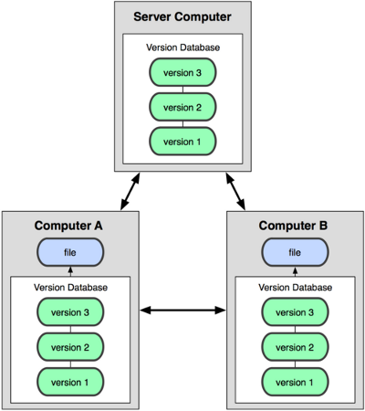

# Git - Distributed Version Control

---
# Was ist Versionskontrolle?
 + Dokumentation von Veränderung von Dateien über der Zeit
 + Wiederherstellbarkeit früherer Versionen   
   ⇒ „If you skrew things up […], you can easily recover“ – *pro Git*
 + Simpelste Form der Versionskontrolle: Kopiere über Zwischenversionen
   von Dateien in ein „Backup“-Verzeichnis

---
# Zentrale Versionskontrollsysteme (CVCS)
 + z. B. CVS, Subversion, Perforce
 + ein zentrales Repository, Clients checken Dateien von dort aus und
   commiten nach dort

 

---
# Zentrale Versionskontrolle
## Vorteile
 + Jeder weiß, was jeder gerade tut
 + Administratoren können kontrolieren, wer was darf und wer was nicht

## Nachteile
 - Single Point of Failure
 - Verbindung zum zentralen Server ist zwingend notwendig

---
# Verteilte Versionskontrollsystem (DVCS)
 + z. B. Git, Mercurial, Bazaar
 + Clients checken Dateien nicht aus, sondern spiegeln das gesamte 
   Repository

 

---
# Git – Eine kurze Geschichtsstunde
 + Linux-Kernel wurde bis 2002 mit Patchdateien via E-Mail 
   versionskontrolliert
 + ab 2002: proprietäres DVCS BitKeeper
 + 2005: Anspannung der Beziehung zwischen Linux-Community und 
   BitKeeper-Entwickler
   ⇒ Linus Torvald entwickelt als Wochenendprojekt Git als Alternative
 + Anforderungen:
    * Geschwindigkeit
    * Einfaches Design
    * Unterstützung nicht-linearer Entwicklung
    * komplett verteilt
    * Unterstützung sehr großer Projekte

---
# Git – Die Grundlagen
 + Snapshots, keine Diffs

 

---
# Git – Die Grundlagen
 + (fast) alle Operationen sind lokal (Ausnahme: `fetch` und `push`
   und Erweiterungen)
 + Checksummen-basiertes speichern (SHA1-Summen sind Objekt-ID)
 + nur Hinzufügen von Daten erlaubt
 + Dateien können 3 Zustände in einem Git-Repository haben:
    * **commited:** Datei in Datenbak gespeichert
    * **verändert:** Datei verändert, aber noch nicht commited
    * **staged:** veränderte Datei, die zum commiten markiert wurde
 + ⇒ Drei Hauptsektionen eines Git-Projekts:
    * Git-Verzeichnis
    * Arbeits-Verzeichnis
    * Staging-Area

---
# Git – Die Grundlagen
 

---
# Plumbing vs. Porcelain
 + *git.git* war ursprünglich nur als Toolkit für 
   Versionskontrollsysteme gedacht  
   ⇒ Viele Low-Level-Befehle, die aneinaneder gekettet 
     benutzerfreundliche Befehle ergeben
 + **Plumbing**: Low-Level-Befehle

        git cat-file
        git hash-object
        git update-index
        git write-tree
        ...

 + **Porcelain**: benutzerfreundlichere Befehle

        git checkout
        git commit
        git remote
        ...

---
# Git-Objekte
 + Alles in einem Git-Repository ist ein Objekt (`.git/objects`)
 + Objekte werden durch eine eindeutige ID (ihre SHA1-Checksumme)
   identifiziert
 + Vier Arten von Objekte:
    * **Blob:** Abbild des Inhalts einer Datei
    * **Tree:** zeigt auf Menge von Blob- und anderen Tree-Objekten 
        (äquivalent zu Verzeichnis in Dateisystemen) und benennt sie 
        (= Dateinamen)
    * **Commit:** zeigt auf ein Tree-Objekt, *mindestens* ein 
        Eltern-Commit-Objekt und hat Eigenschaften wie Autor, Commiter, 
        Commit-Nachricht und Zeitstempel
    * **Tag:** zeigt auf Objekt und Eigenschaften wie Tagger,
        Zeitstempel und Tag-Nachricht

---
# Git-Objekte
 

---
# Git-Referenzen
 + Obvious flaw is obvious: 160-Bit-Hashes sind schwer zu merken 
    ⇒ Referenzen 
 + Dateien im `.git/refs`-Verzeichnis mit einem Hashwert oder 
   `ref: refs/...` als Inhalt)
    * Branches (`refs/heads/<name>`)
    * Der aktuelle Kopf (`refs/HEAD`)
    * leichtgewichtige Tags (`refs/tags/<name>`)
    * entfernte Repositories (`refs/remotes/<repo_name>/<branchname>`)
 + Unterschied zu Referenzen und Tag-Objekten (annotierte Tags):
    Referenzen können verschoben werden

---
# Packfiles
 + `.git/objects/pack`?
 + `[0-9]{2}/`-Objekte sind so genannte loose objects
 + Snapshots werden mit der Zeit sehr groß (besonders bei großen Dateien)
 + `git gc` komprimiert mit Delta- und zlib-Komprimierung
 + Speichert Ergebnisse in `pack-*.idx` (ein Index der komprimierten
   Objekte) und `pack-*.pack` (die komprimierten Objekte)
 + Half-byte orientierte Bytedateien in network order

---
# Git konfigurieren
 + Konfiguration geschieht mit `git config`
 + Manipulation von 3 verschiedenen Dateien:
    * `/etc/gitconfig`: Systemweite Konfiguration (`--system`)
    * `$HOME/.gitconfig`: globale Konfiguration (`--global`)
    * `$REPO_PATH/.git/config`: repo-spezifische Konfiguration

---
# Git konfigurieren
 + Dinge die vorm ersten Einsatz (global) konfiguriert werden sollten:
    * Identität: `user.name` und `user.email`
    * Editor: `core.editor`
    * Diff-Editor: `merge.tool`
 + Nice to have:
    * Farbe: `git config --global color.ui true`
    * Password caching: `git config --global credential.helper 'cache --timeout=3600'`
    * Aliases: `git config --global alias.ci commit`
    * Trailing Spaces entfernen:

            git config --global core.whitespace trailing-space
            git config --global apply.whitespace fix

---
# Git-Repositories

 * Repository lokal erstellen

        git init
        git init --bare

 * entferntes Repository herunterladen

        git clone <url> [dir]

    + Git unterstützt mehrere Protokolle
        - lokales Dateisystem: `git clone <path>`
        - HTTP/HTTPS (The *dumb* protocol): `git clone http[s]://<host>/<path>`
        - Git-Protocol (unauthentifiziert): `git clone git://<host>/<path>`
        - SSH (authentifiziert): `git clone [<username>@]<host>:<path>`

---
# Literatur
 + <a href="http://git-scm.com/book">Pro Git, *Scott Chacon*</a>
 + <a href="http://git-scm.com/docs">Manpages</a> (`git help [<command>]` oder `man git [<command>]`)
